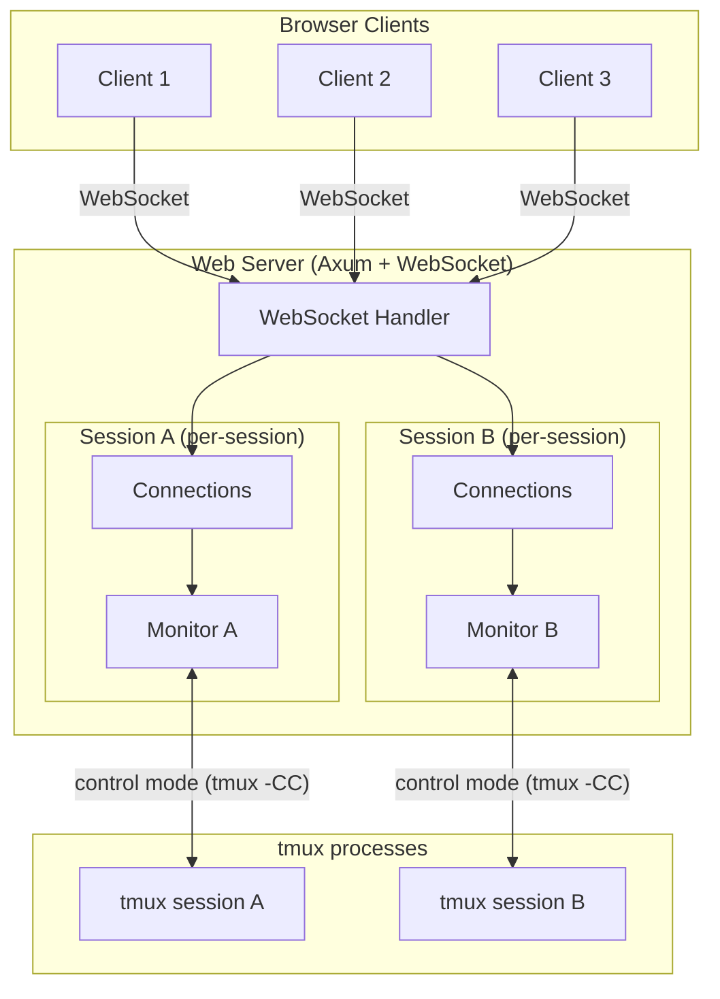
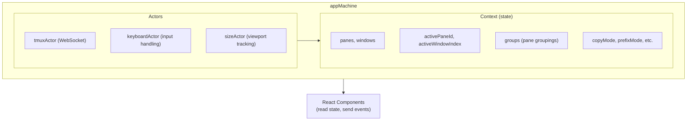
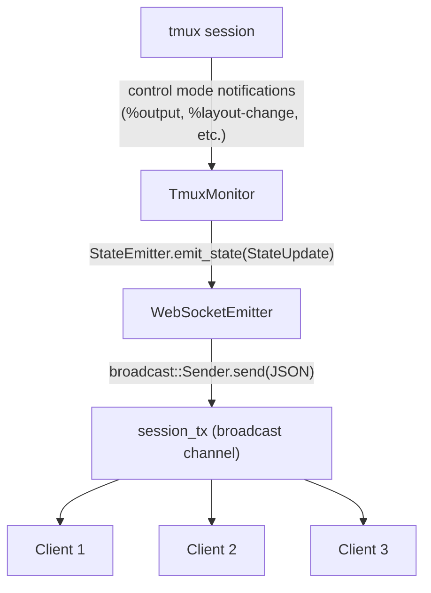
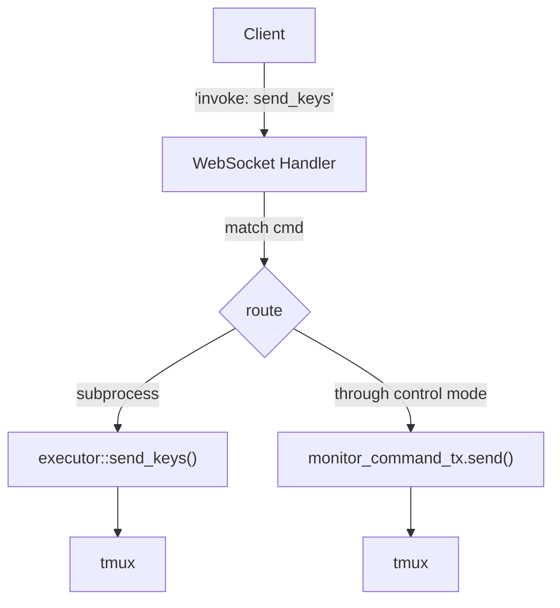
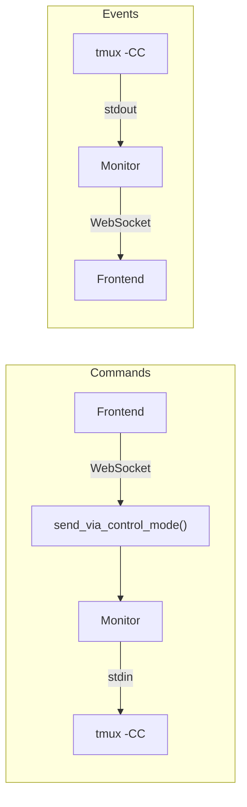

# Tmuxy Architecture

This document describes the architecture of tmuxy, a web-based tmux interface.

## Overview

Tmuxy provides a browser-based UI for tmux sessions. It consists of:

1. **tmuxy-core** - Rust library for tmux interaction
2. **web-server** - Axum web server with WebSocket support
3. **tmuxy-ui** - React frontend with XState state machine
4. **tauri-app** - Desktop app wrapper (optional)



## Key Components

### 1. TmuxMonitor (tmuxy-core)

The `TmuxMonitor` connects to tmux using **control mode** (`tmux -CC`), which provides:
- Real-time event notifications (pane content changes, layout changes, etc.)
- Ability to send commands through the same connection
- No polling required

**One monitor per session.** When the first client connects to a session, a monitor is spawned. When the last client disconnects, the monitor is stopped.

```rust
pub struct TmuxMonitor {
    connection: ControlModeConnection,
    state: StateAggregator,
    config: MonitorConfig,
    command_rx: mpsc::Receiver<MonitorCommand>,  // External commands (resize, etc.)
}
```

The monitor exposes a command channel (`MonitorCommandSender`) for external code to send commands through the control mode connection. This is critical because **some tmux commands only work when sent through the control mode connection**, not via external `tmux` subprocess calls.

### 2. SessionConnections (web-server)

Tracks all clients connected to a single tmux session:

```rust
pub struct SessionConnections {
    pub connections: Vec<u64>,             // All connection IDs
    pub connection_channels: HashMap<...>, // Per-connection direct message channels
    pub client_sizes: HashMap<u64, (u32, u32)>,  // Viewport sizes
    pub monitor_command_tx: Option<MonitorCommandSender>,  // Commands to monitor
    pub state_tx: broadcast::Sender<String>,  // Shared state updates
    pub monitor_handle: Option<JoinHandle<()>>,  // Monitor task handle
}
```

**Shared resources:**
- `state_tx` - Broadcast channel for state updates, shared by all clients in the session
- `monitor_command_tx` - Channel to send commands to the session's monitor
- `monitor_handle` - Task handle to stop monitor when last client leaves

### 3. Multi-Client Viewport Sizing

Like native tmux, when multiple clients connect to the same session, the **session is sized to the smallest client's viewport**.

```
Client A: 120x40 viewport
Client B:  80x24 viewport
                ↓
Session sized to: 80x24
```

**How it works:**
1. Each client reports its viewport size via `set_client_size`
2. Server computes the minimum across all connected clients
3. Server sends resize command through the monitor's control mode connection

**Why resize commands go through the monitor:**

When a control mode client is attached to a tmux session, external `tmux resize-window` commands (run via subprocess) are ignored. Resize commands must be sent **through the control mode connection** to take effect.

```rust
// MonitorCommand enum
pub enum MonitorCommand {
    ResizeWindow { cols: u32, rows: u32 },
}

// In set_client_size - server computes minimum and resizes:
let (min_cols, min_rows) = compute_min_client_size(&session_conns.client_sizes);
if let Some(tx) = command_tx {
    tx.send(MonitorCommand::ResizeWindow { cols: min_cols, rows: min_rows }).await;
}
```

### 4. WebSocket Protocol

**Client → Server:**
```json
{ "type": "invoke", "id": "uuid", "cmd": "command_name", "args": {...} }
```

**Server → Client:**
```json
// Command responses
{ "type": "response", "id": "uuid", "result": ... }
{ "type": "error", "id": "uuid", "error": "message" }

// State updates (broadcast to all clients)
{ "type": "event", "name": "tmux-state-update", "payload": {...} }

// Connection management
{ "type": "connection_info", "connection_id": 1 }
```

### 5. Frontend State Machine (XState)

The React frontend uses XState for state management. All client logic lives in the state machine, not in React components.



## Data Flow

### Connection Lifecycle

1. **Client connects** via WebSocket with `?session=name`
2. Server generates unique `connection_id`
3. Server checks if session monitor exists:
   - **No monitor:** Start new monitor, store handle in `SessionConnections`
   - **Has monitor:** Subscribe to existing `state_tx` channel
5. Client receives `connection_info` message
6. Client sends `get_initial_state` with viewport size
7. Server stores client size, computes minimum across all clients
8. Server sends resize command through monitor's control mode connection

### State Update Flow



### Command Execution Flow



## Tmux Configuration

For multi-client viewport sizing to work correctly:

```bash
# ~/.tmux.conf or docker/.tmuxy.conf
setw -g aggressive-resize off   # Don't auto-resize to largest client
set -g window-size manual       # Manual control over window size
```

## File Structure

```
packages/
├── tmuxy-core/
│   └── src/
│       ├── control_mode/
│       │   ├── connection.rs   # ControlModeConnection (tmux -CC)
│       │   ├── monitor.rs      # TmuxMonitor, MonitorCommand
│       │   ├── state.rs        # StateAggregator
│       │   └── parser.rs       # Control mode event parser
│       ├── executor.rs         # Subprocess tmux commands
│       └── session.rs          # Session management
├── web-server/
│   └── src/
│       ├── main.rs             # Server setup, AppState, SessionConnections
│       └── websocket.rs        # WebSocket handling, state broadcasting
└── tmuxy-ui/
    └── src/
        ├── machines/
        │   ├── app/
        │   │   └── appMachine.ts   # Main state machine
        │   └── actors/
        │       ├── tmuxActor.ts    # WebSocket actor
        │       └── keyboardActor.ts
        └── components/
            ├── Terminal.tsx
            ├── PaneLayout.tsx
            └── StatusBar.tsx
```

## Tmux Control Mode Command Routing

**Critical:** All tmux commands must be sent through the control mode stdin connection, NOT via external subprocess calls.

When tmux control mode (`tmux -CC`) is attached to a session, running external `tmux` commands as separate processes can crash the tmux server (observed in tmux 3.3a). This is by design - the [tmux Control Mode documentation](https://github.com/tmux/tmux/wiki/Control-Mode) states that commands should be sent through the control mode client.

### Architecture



### Implementation

All WebSocket command handlers route through `send_via_control_mode()`:

```rust
async fn send_via_control_mode(state: &Arc<AppState>, session: &str, command: &str) -> Result<(), String> {
    let command_tx = {
        let sessions = state.sessions.read().await;
        sessions.get(session).and_then(|s| s.monitor_command_tx.clone())
    };

    if let Some(tx) = command_tx {
        tx.send(MonitorCommand::RunCommand { command: command.to_string() })
            .await
            .map_err(|e| format!("Monitor channel error: {}", e))
    } else {
        Err("No monitor connection available".to_string())
    }
}
```

### Short Command Forms

Use tmux short command aliases (preferred in control mode):

| Long Form | Short Form |
|-----------|------------|
| `new-window` | `neww` |
| `split-window` | `splitw` |
| `select-pane` | `selectp` |
| `select-window` | `selectw` |
| `kill-pane` | `killp` |
| `kill-window` | `killw` |
| `resize-pane` | `resizep` |
| `resize-window` | `resizew` |
| `send-keys` | `send` |
| `next-window` | `next` |
| `previous-window` | `prev` |

**Note:** `new` is short for `new-session`, NOT `new-window`. Use `neww` for creating windows.

See [.agents/learnings/2026_02_09_tmux_control_mode.md](.agents/learnings/2026_02_09_tmux_control_mode.md) for detailed documentation.

## Key Design Decisions

1. **One monitor per session** - Avoids duplicate control mode connections and ensures resize commands work reliably.

2. **Resize through control mode** - External `tmux resize-window` commands are ignored when control mode is attached. All resize commands go through the monitor's command channel.

3. **Minimum viewport sizing** - Server computes the minimum viewport size across all connected clients and resizes the session accordingly. No "primary" client concept needed.

4. **Broadcast channel for state** - All clients in a session share a single broadcast channel for state updates, reducing memory and CPU overhead.

5. **State machine in frontend** - All client logic lives in XState, keeping React components purely presentational.
