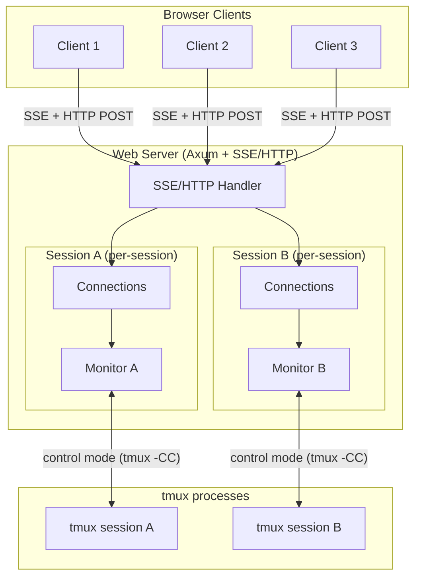
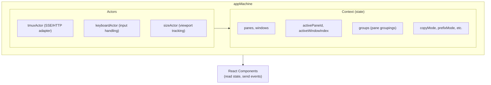
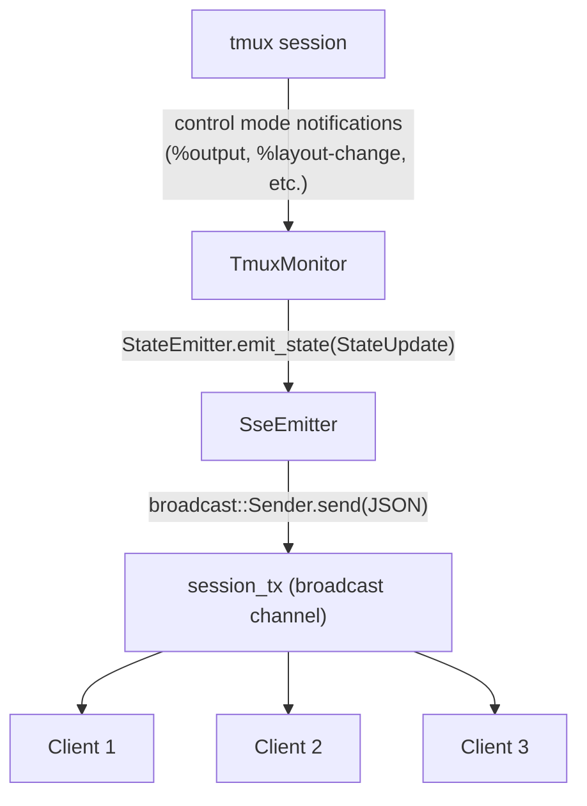
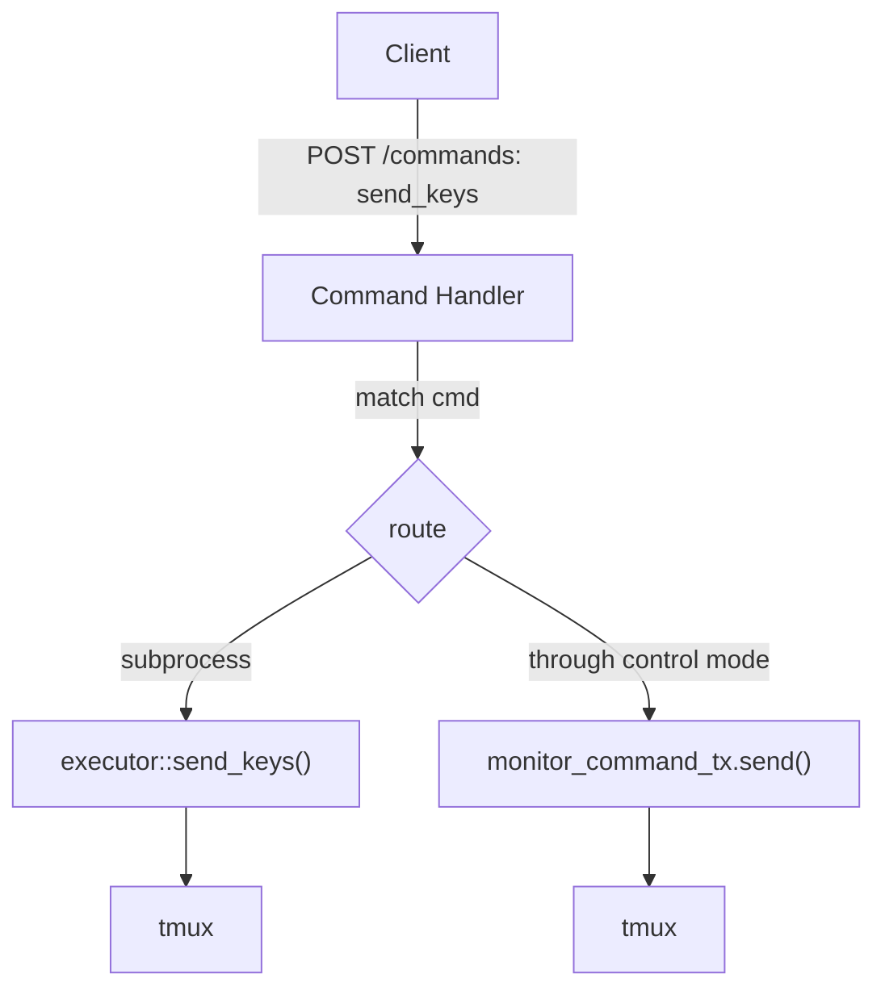
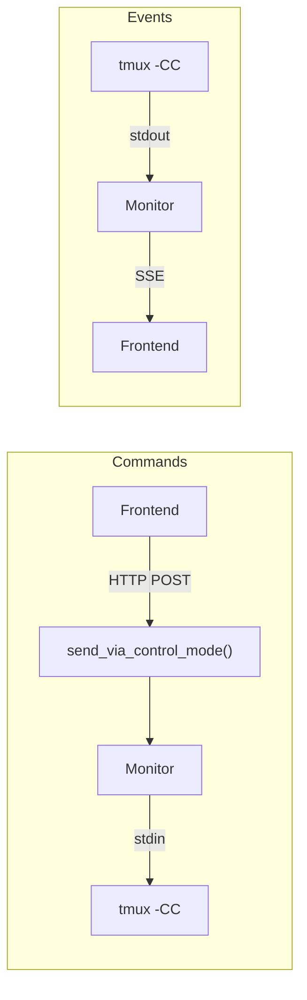

# Tmuxy Architecture

This document describes the architecture of tmuxy, a web-based tmux interface.

## Overview

Tmuxy provides a browser-based UI for tmux sessions. It consists of:

1. **tmuxy-core** - Rust library for tmux interaction
2. **web-server** - Axum web server with SSE and HTTP endpoints
3. **tmuxy-ui** - React frontend with XState state machine
4. **tauri-app** - Desktop app wrapper (optional)



## Key Components

### 1. TmuxMonitor (tmuxy-core)

The `TmuxMonitor` connects to tmux using **control mode** (`tmux -CC`), which provides:
- Real-time event notifications (pane content changes, layout changes, etc.)
- Ability to send commands through the same connection
- No polling required

**One monitor per session.** When the first client connects to a session, a monitor is spawned. When the last client disconnects, the monitor is stopped.

The monitor holds a `ControlModeConnection`, a `StateAggregator` (field: `aggregator`), a `MonitorConfig`, and a `command_rx` receiver for external commands. See `tmuxy-core/src/control_mode/monitor.rs` for the full definition.

It exposes a command channel (`MonitorCommandSender`) for external code to send commands through the control mode connection. This is critical because **some tmux commands only work when sent through the control mode connection**, not via external `tmux` subprocess calls.

### 2. SessionConnections (web-server)

Tracks all clients connected to a single tmux session:

Key fields (see `web-server/src/lib.rs` for the full definition):
- `connections` — All connection IDs in order
- `client_sizes` — Each client's reported viewport size (cols, rows)
- `last_resize` — Last resize dimensions sent to tmux (avoids redundant resize commands)
- `monitor_command_tx` — Channel to send commands to the session's monitor
- `state_tx` — Broadcast channel for state updates, shared by all clients in the session
- `monitor_handle` — Task handle to stop monitor when last client leaves

### 3. Multi-Client Viewport Sizing

Like native tmux, when multiple clients connect to the same session, the **session is sized to the smallest client's viewport**.

```
Client A: 120x40 viewport
Client B:  80x24 viewport
                ↓
Session sized to: 80x24
```

**How it works:**
1. Each client reports its viewport size via `set_client_size`
2. Server computes the minimum across all connected clients
3. Server sends resize command through the monitor's control mode connection

**Why resize commands go through the monitor:**

When a control mode client is attached to a tmux session, external `tmux resize-window` commands (run via subprocess) are ignored. Resize commands must be sent **through the control mode connection** to take effect.

The `MonitorCommand` enum includes `ResizeWindow { cols, rows }`, `RunCommand { command }`, and `Shutdown`. When `set_client_size` is called, the server computes the minimum viewport across all clients and sends `MonitorCommand::ResizeWindow` through the monitor's command channel. See `tmuxy-core/src/control_mode/monitor.rs` for the enum and `web-server/src/sse.rs` for the resize logic.

### 4. SSE/HTTP Protocol

**Client → Server (HTTP POST `/commands`):**
```json
{ "cmd": "command_name", "args": {...} }
```

**Server → Client (HTTP POST response):**
```json
{ "result": ... }
{ "error": "message" }
```

**Server → Client (SSE stream `GET /events`):**
```json
// State updates (broadcast to all clients)
event: state-update
data: { "event": "state-update", "data": {...} }

// Connection info (on initial connect)
event: connection-info
data: { "event": "connection-info", "data": { "connection_id": 1, "session_token": "...", "default_shell": "..." } }

// Keybindings
event: keybindings
data: { "event": "keybindings", "data": {...} }
```

### 5. Frontend State Machine (XState)

The React frontend uses XState for state management. All client logic lives in the state machine, not in React components.



## Data Flow

### Connection Lifecycle

1. **Client connects** via SSE (`GET /events?session=name`)
2. Server generates unique `connection_id`
3. Server checks if session monitor exists:
   - **No monitor:** Start new monitor, store handle in `SessionConnections`
   - **Has monitor:** Subscribe to existing `state_tx` channel
5. Client receives `connection_info` message
6. Client sends `get_initial_state` with viewport size
7. Server stores client size, computes minimum across all clients
8. Server sends resize command through monitor's control mode connection

### State Update Flow



### Command Execution Flow



## Tmux Configuration

For multi-client viewport sizing to work correctly:

```bash
# ~/.tmux.conf or docker/.tmuxy.conf
setw -g aggressive-resize off   # Don't auto-resize to largest client
set -g window-size manual       # Manual control over window size
```

## File Structure

```
packages/
├── tmuxy-core/
│   └── src/
│       ├── control_mode/
│       │   ├── connection.rs   # ControlModeConnection (tmux -CC)
│       │   ├── monitor.rs      # TmuxMonitor, MonitorCommand
│       │   ├── state.rs        # StateAggregator
│       │   └── parser.rs       # Control mode event parser
│       ├── executor.rs         # Subprocess tmux commands
│       └── session.rs          # Session management
├── web-server/
│   └── src/
│       ├── main.rs             # Server setup, AppState, SessionConnections
│       └── sse.rs              # SSE streaming, HTTP command handling
└── tmuxy-ui/
    └── src/
        ├── machines/
        │   ├── app/
        │   │   └── appMachine.ts   # Main state machine
        │   └── actors/
        │       ├── tmuxActor.ts    # Backend communication actor
        │       └── keyboardActor.ts
        ├── tmux/
        │   └── demo/              # In-browser demo engine
        │       ├── DemoAdapter.ts  # TmuxAdapter for demo/landing page
        │       ├── DemoTmux.ts     # Simulated tmux server
        │       └── DemoShell.ts    # Simulated shell
        └── components/
            ├── Terminal.tsx
            ├── PaneLayout.tsx
            └── StatusBar.tsx
```

## Tmux Control Mode Command Routing

**Critical:** All tmux commands must be sent through the control mode stdin connection, NOT via external subprocess calls.

When tmux control mode (`tmux -CC`) is attached to a session, running external `tmux` commands as separate processes can crash the tmux server (observed in tmux 3.3a and 3.5a). See [tmux.md](tmux.md) for version-specific workarounds.

### Architecture



### Implementation

All HTTP command handlers route through `send_via_control_mode()` in `web-server/src/sse.rs`. This function looks up the session's `monitor_command_tx` and sends `MonitorCommand::RunCommand` through the channel.

### Short Command Forms

Use tmux short command aliases (preferred in control mode):

| Long Form | Short Form |
|-----------|------------|
| `new-window` | `neww` |
| `split-window` | `splitw` |
| `select-pane` | `selectp` |
| `select-window` | `selectw` |
| `kill-pane` | `killp` |
| `kill-window` | `killw` |
| `resize-pane` | `resizep` |
| `resize-window` | `resizew` |
| `send-keys` | `send` |
| `next-window` | `next` |
| `previous-window` | `prev` |

**Note:** `new` is short for `new-session`, NOT `new-window`. Use `neww` for creating windows.

See the [tmux Control Mode wiki](https://github.com/tmux/tmux/wiki/Control-Mode) for detailed documentation.

## Key Design Decisions

1. **One monitor per session** - Avoids duplicate control mode connections and ensures resize commands work reliably.

2. **Resize through control mode** - External `tmux resize-window` commands are ignored when control mode is attached. All resize commands go through the monitor's command channel.

3. **Minimum viewport sizing** - Server computes the minimum viewport size across all connected clients and resizes the session accordingly. No "primary" client concept needed.

4. **Broadcast channel for state** - All clients in a session share a single broadcast channel for state updates, reducing memory and CPU overhead.

5. **State machine in frontend** - All client logic lives in XState, keeping React components purely presentational.

## Testing

The project has three distinct testing approaches, each serving different purposes.

### 1. E2E Snapshot Tests (Jest + Playwright)

**Goal:** Verify the UI renders terminal content identically to native tmux.

These tests compare two text snapshots: the UI snapshot (`window.getSnapshot()`) and the tmux snapshot (`tmux capture-pane -p`). Suites opt in via `createTestContext({ snapshot: true })`. Comparison uses `assertStateMatches()` from `tests/helpers/consistency.js` with Levenshtein edit distance tolerance (≤8 chars per row).

**Enabled for:** Rendering-focused suites (basic connectivity, floating panes, status bar, OSC protocols).

### 2. E2E Functional Tests (Jest + Playwright)

**Goal:** Verify features work correctly with real browser interactions.

Tests use real tmux sessions, real keyboard/mouse events, and real SSE/HTTP connections. No mocking. Categories include keyboard input, pane/window operations, mouse events, copy mode, status bar, session connection, OSC protocols, and workflows.

### 3. E2E Performance Tests (Jest + Playwright)

**Goal:** Ensure operations complete within acceptable time bounds.

Metrics: rapid output (yes | head -500), large output (seq 1 2000), many panes (6+), keyboard latency (<500ms), mouse click latency (<500ms), workflow round-trips (<15s).

### 4. Glitch Detection Tests (Jest + Playwright + MutationObserver)

**Goal:** Detect visual instability (flicker, layout shifts, attribute churn) that functional tests miss.

These tests inject MutationObserver + size polling into the browser to catch DOM mutations during operations. Detection types: node flicker (added+removed within 100ms), attribute churn (>2 changes in 200ms), size jumps (>20px outside resize). See `tests/helpers/glitch-detector.js` for the `GlitchDetector` implementation.

### 5. Unit Tests (Vitest + React Testing Library)

**Goal:** Test React components and utilities in isolation. Scope: component rendering, props handling, accessibility attributes, demo engine logic. Tests live in `packages/tmuxy-ui/src/test/` and `packages/tmuxy-ui/src/tmux/demo/__tests__/`.

### Running Tests

See [tests.md](tests.md) for commands and details.

### Test Files

```
tests/
├── helpers/
│   ├── TmuxTestSession.js    # Tmux session wrapper
│   ├── browser.js            # Playwright utilities
│   ├── ui.js                 # UI interaction helpers
│   ├── glitch-detector.js    # MutationObserver harness for flicker detection
│   ├── consistency.js        # UI↔tmux state consistency checks
│   └── test-setup.js         # Context factory, snapshot comparison
├── 1-input-interaction.test.js    # Scenarios 2, 7, 8, 9, 10, 21
├── 2-layout-navigation.test.js   # Scenarios 4, 5, 6, 11
├── 3-rendering-protocols.test.js  # Scenarios 14, 16, widgets
├── 4-session-connectivity.test.js # Scenarios 12, 13
└── 5-stress-stability.test.js     # Scenarios 17, 18, 19, 20

packages/tmuxy-ui/src/test/
├── Terminal.test.tsx              # Terminal component tests
└── App.test.tsx                   # App component tests
```
