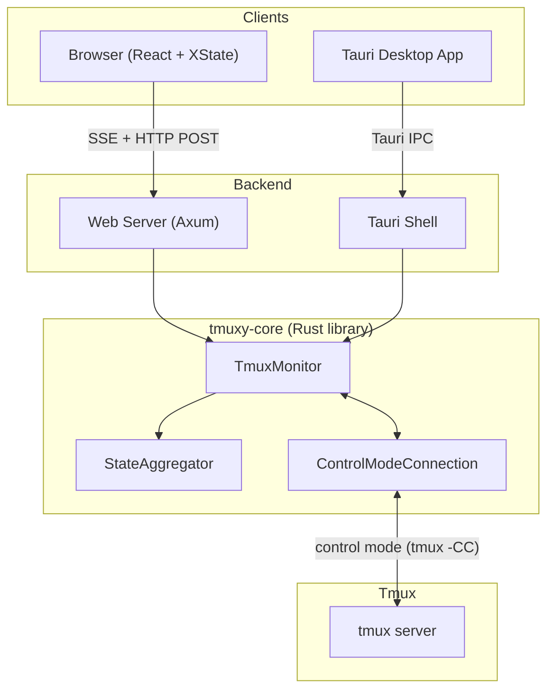

# Tmuxy Architecture

Tmuxy is a web-based tmux interface. It provides a browser UI (or native desktop app) for managing tmux sessions with real-time state synchronization.

## Components



**tmuxy-core** — Rust library that manages tmux control mode connections. Contains `TmuxMonitor` (event loop), `StateAggregator` (event processing), `ControlModeConnection` (stdin/stdout to `tmux -CC`), and the executor module for safe subprocess calls. See [state-management.md](state-management.md) for details.

**web-server** — Axum HTTP server providing SSE streaming and HTTP POST command endpoints. Manages per-session connections, multi-client viewport sizing, and session tokens. Shared between the dev server and production server (`tmuxy-server`).

**tmuxy-server** — Production binary that embeds the compiled frontend assets and serves them alongside the web-server API routes.

**tmuxy-ui** — React frontend using XState for all state management. Communicates with the backend via an adapter pattern (`TmuxAdapter` interface). Includes an in-browser demo engine (`DemoAdapter`, `DemoTmux`, `DemoShell`) for the landing page. See [state-management.md](state-management.md) for the XState architecture.

**tauri-app** — Optional desktop wrapper using Tauri. Communicates via native IPC instead of HTTP, offering lower latency. Currently single-client only (no multi-client support). See [data-flow.md](data-flow.md) for the Tauri data flow.

## How They Interact

1. The **frontend** connects to the backend via SSE (web) or Tauri events (desktop) to receive real-time state updates, and sends commands via HTTP POST (web) or Tauri invoke (desktop).

2. The **backend** maintains one `TmuxMonitor` per tmux session. When the first client connects to a session, a monitor is spawned. When the last client disconnects, the monitor shuts down.

3. The **monitor** holds a `ControlModeConnection` — a persistent `tmux -CC attach-session` subprocess. All state-modifying commands go through the control mode stdin connection. See [tmux.md](tmux.md) for why this is critical.

4. tmux sends real-time notifications (`%output`, `%layout-change`, `%window-add`, etc.) through control mode stdout. The `StateAggregator` processes these into `StateUpdate` objects (full snapshots or incremental deltas).

5. State updates are emitted via the `StateEmitter` trait — `SseEmitter` broadcasts to all SSE clients in a session, `TauriEmitter` emits Tauri events to the desktop app.

6. The frontend's XState machine merges state updates into its context, and React components re-render via selector hooks. See [data-flow.md](data-flow.md) for detailed flow diagrams.

## Multi-Client Viewport Sizing

Like native tmux, when multiple browser clients connect to the same session, the session is sized to the **smallest client's viewport**. Each client reports its viewport size, the server computes the minimum, and sends a resize command through the monitor's control mode connection. Resize commands must go through control mode — external `tmux resize-window` commands are ignored when a control mode client is attached.

## Key Design Decisions

1. **One monitor per session** — Avoids duplicate control mode connections and ensures resize commands work reliably.

2. **All commands through control mode** — External tmux subprocess calls can crash the tmux server when control mode is attached. See [tmux.md](tmux.md).

3. **State machine in frontend** — All client logic lives in XState, keeping React components purely presentational. No `useEffect` side effects.

4. **Adapter pattern for transport** — `TmuxAdapter` interface abstracts SSE/HTTP vs Tauri IPC, making the frontend transport-agnostic.

5. **Delta protocol** — After the initial full state snapshot, the server sends incremental deltas (changed panes, windows) to minimize bandwidth.

6. **Adaptive throttling** — The monitor throttles state emissions during high-frequency output (>20 events per 100ms) at 16ms intervals (~60fps), and emits immediately during low-frequency interactions for responsive typing feedback.

## File Structure

```
packages/
├── tmuxy-core/
│   └── src/
│       ├── control_mode/
│       │   ├── connection.rs   # ControlModeConnection (tmux -CC)
│       │   ├── monitor.rs      # TmuxMonitor, MonitorCommand, StateEmitter
│       │   ├── state.rs        # StateAggregator, PaneState, layout parsing
│       │   └── parser.rs       # Control mode event parser
│       ├── executor.rs         # Subprocess tmux commands (safe operations only)
│       └── session.rs          # Session lifecycle (create, destroy, check)
├── web-server/
│   └── src/
│       ├── lib.rs              # AppState, SessionConnections, api_routes()
│       └── sse.rs              # SSE streaming, HTTP commands, SseEmitter
├── tmuxy-server/
│   └── src/
│       └── main.rs             # Production server with embedded frontend
├── tmuxy-ui/
│   └── src/
│       ├── machines/
│       │   ├── app/appMachine.ts   # Main XState machine
│       │   ├── actors/             # tmuxActor, keyboardActor, sizeActor
│       │   ├── drag/               # Pane drag child machine
│       │   ├── resize/             # Pane resize child machine
│       │   ├── AppContext.tsx       # Provider, hooks (useAppSelector, etc.)
│       │   └── selectors.ts        # State selectors for components
│       ├── tmux/
│       │   ├── types.ts            # TmuxAdapter, TmuxPane, TmuxWindow
│       │   ├── adapters.ts         # HttpAdapter, TauriAdapter
│       │   └── demo/               # In-browser demo engine
│       └── components/             # React components (Terminal, PaneLayout, etc.)
└── tauri-app/
    └── src/
        ├── main.rs                 # Tauri app setup, command registration
        ├── commands.rs             # Tauri IPC command handlers
        └── monitor.rs              # TauriEmitter, control mode monitoring
```

## Related Documentation

| Document | Covers |
|----------|--------|
| [state-management.md](state-management.md) | Frontend XState + backend Rust state in detail |
| [data-flow.md](data-flow.md) | SSE/HTTP protocol, Tauri IPC, real-world deployment scenarios |
| [tmux.md](tmux.md) | Control mode routing, version-specific bugs, workarounds |
| [copy-mode.md](copy-mode.md) | Client-side copy mode reimplementation |
| [security.md](security.md) | Security risks, mitigations, deployment warnings |
| [tests.md](tests.md) | Test framework, running tests, conventions |
| [e2e-test-scenarios.md](e2e-test-scenarios.md) | Comprehensive test coverage planning |
| [non-goals.md](non-goals.md) | What tmuxy intentionally does NOT do |
| [rich-rendering.md](rich-rendering.md) | Terminal image/OSC protocol support |
